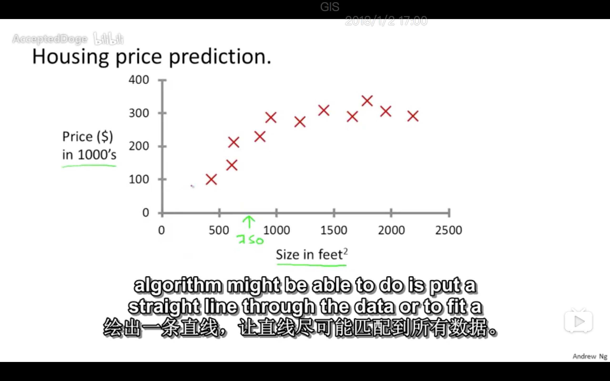
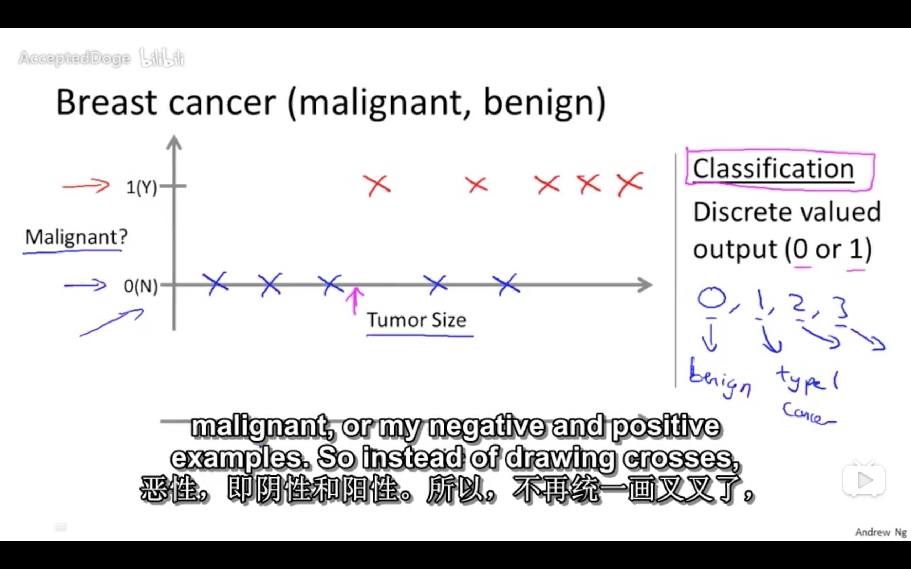
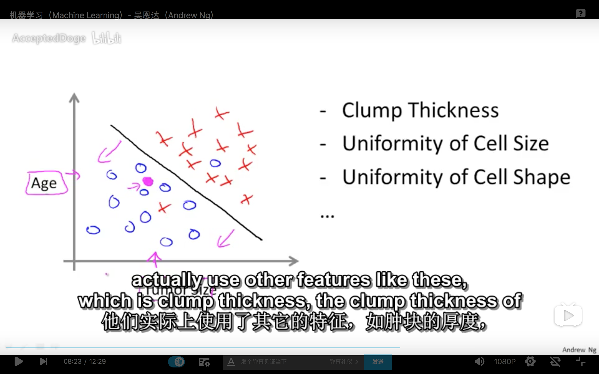
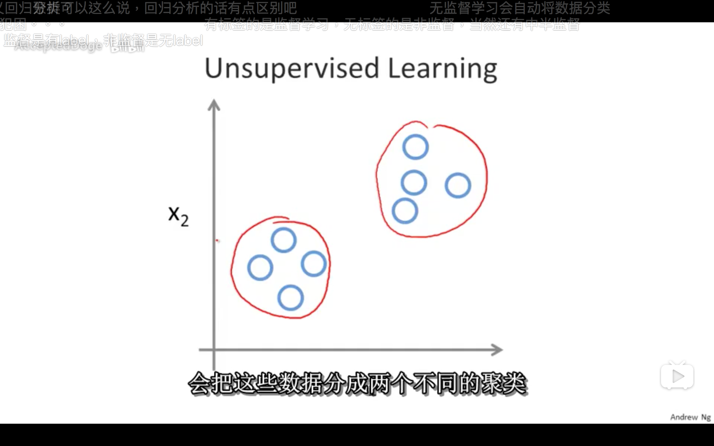
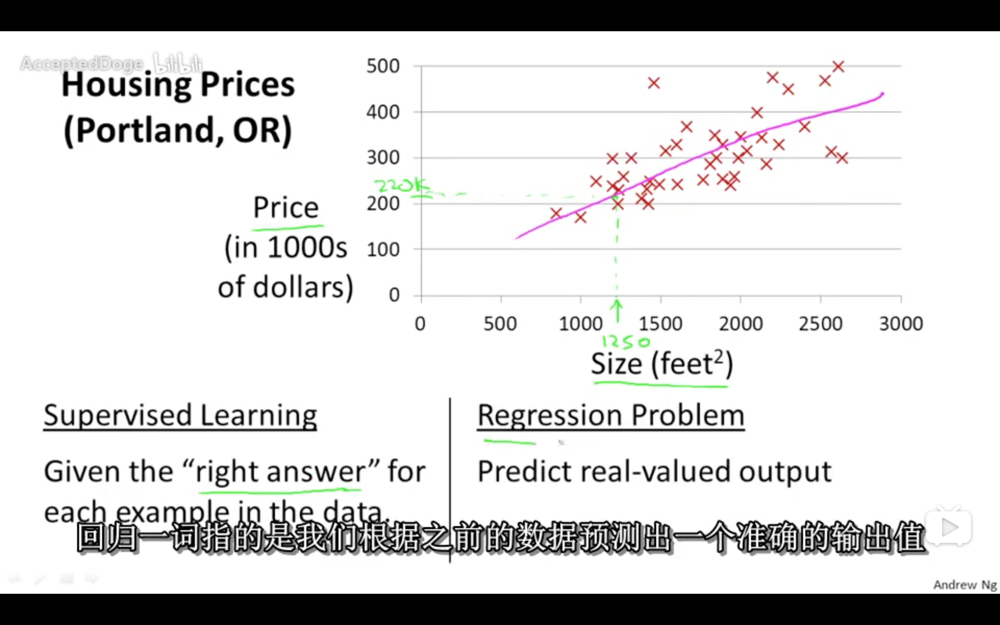
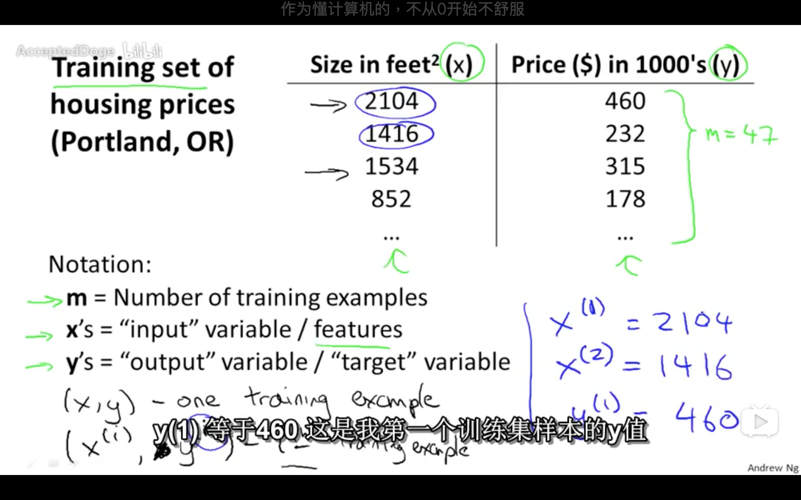
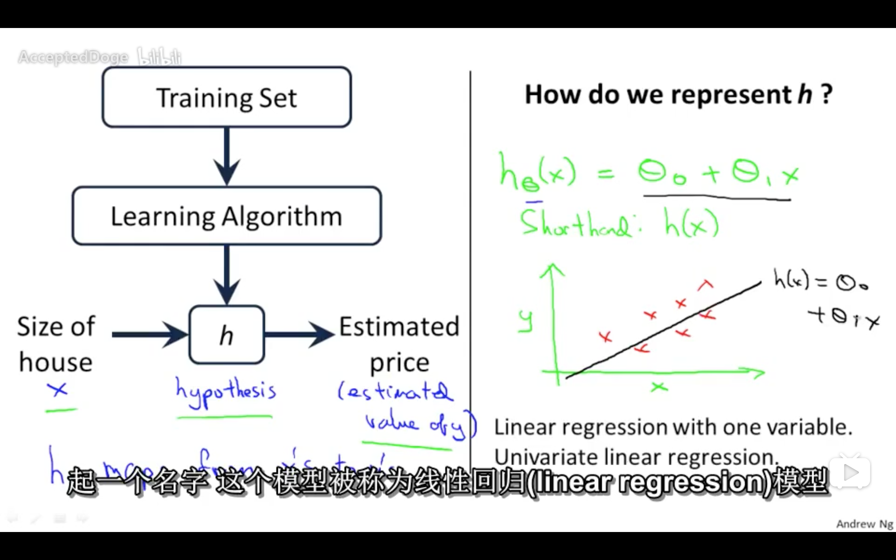

## 机器学习 Machine Learning by Andrew Ng

Notes by Allen Cee

## Lecture 01 机器学习简介

#### 机器学习算法 Machine learning algorithms

**常见算法**

- Supervised learning 监督学习
- Unsupervised learning 无监督学习

**其他**

- Reinforcement learning 强化学习
- Recommender systems 推荐系统

#### 监督学习 Supervised Learning

1. 监督学习：已知部分数据集，给出算法，预测新数据

   1. 回归问题 Regression Problem：监督学习的一种，预测连续值 continuous values（如房价、股价）[Fig 01-01]

      

   2. 分类问题 Classification Problem：监督学习的一种，预测离散值输出 discrete valued ouput（如肿瘤性质） [Fig 01-02] & [Fig 01-03]

      

      

* 学习算法能够处理无穷多的属性（支持向量机 Support Vector）

####无监督学习 Unsupervised Learning

1. 无监督学习：数据集中所有数据是一样的、没有属性，通过算法，找到某种结构（如谷歌新闻分类、特定基因判定）【个人感觉和主成分分析、因子正则化比较像】

   1. 聚类 Cluster：无监督学习的一种，具体定义还不清楚，将无属性数据通过算法分出不同属性的类（如社交网络分析、市场分割、星体分类等）[Fig 01-04]

      

* 鸡尾酒宴会问题 Cocktail Party Problem：不同音源如何区分；有鸡尾酒算法
* Octave常用来开发程序原型，因为内置了很多学习算法，如`svd()`奇艺值分解

## Lecture 02 模型基础

#### 模型表示 Model Representation

[Eg 01-01: Housing Prices] & [Fig 01-05]

* 训练集 Training Set：监督学习中已知的数据集 [Fig 01-06]

  

**机器学习中常见表示**

* $m$：训练集样本数量

* $x^{(i)}$：训练集第$i$行的$x$的值

* $y^{(i)}$：训练集第$i$行的$y$的值

* $h_{\theta}/h$：假设函数（$x\to y$的映射）

* $\theta_i$：模型参数

   

#### 成本函数 Cost Function

